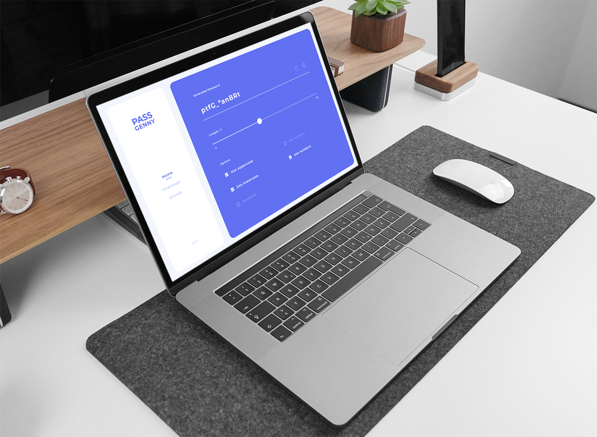

# PASS GENNY

<kbd>Challenge #1</kbd>

Password generator made for my DESIGN/DEV challenges. 

## Features
- [x] Generate Passwords
- [ ] Choice of options
  - [x] Uppercase
  - [x] Lowercase
  - [x] Symbols
  - [x] Numbers
  - [ ] Readable
- [x] Variable Length
- [x] Copy to clipboard
- [x] Responsive (_had no time, will do it in the future, maybe_)

## Challenge description

Make a password generator **Design + Code** in 2 days or less.

### Design
Design was made in 4-6h in Figma, did not track the time very well.

You can check the Figma file [here](https://www.figma.com/file/UqKfdepVu3H9cD9EYRuNNJ/pass-genny?node-id=0%3A1)

### Code
Code related stuff was done in around 4h, code + setting up repo, deploying to vercel.

### Tech
For the website I used:
* [Svelte](https://svelte.dev/), + [svelte-routing](https://github.com/EmilTholin/svelte-routing)
* [Tilt.js](https://github.com/gijsroge/tilt.js)

Otherwise everyting else is done by me :)

#### Help me get RICHHHH, give the repo some love! :heart:
JK, but feel free to give the repo a star or share the word if you enjoyed the project. I sure did!

## Usage

1. `npm install`
2. `npm run dev`
